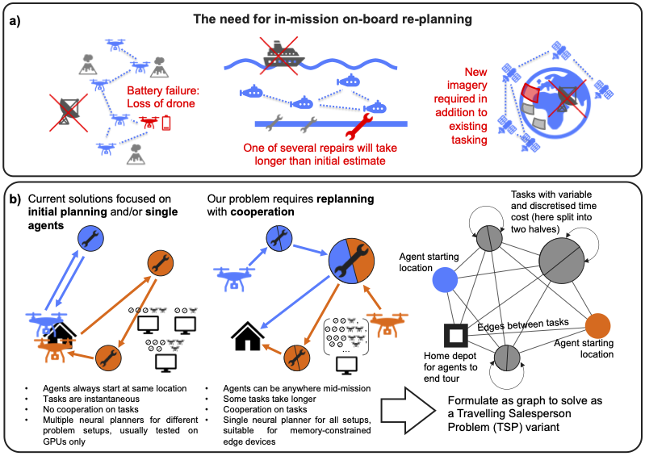
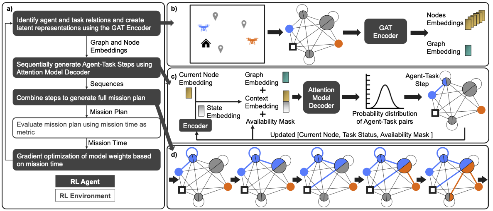
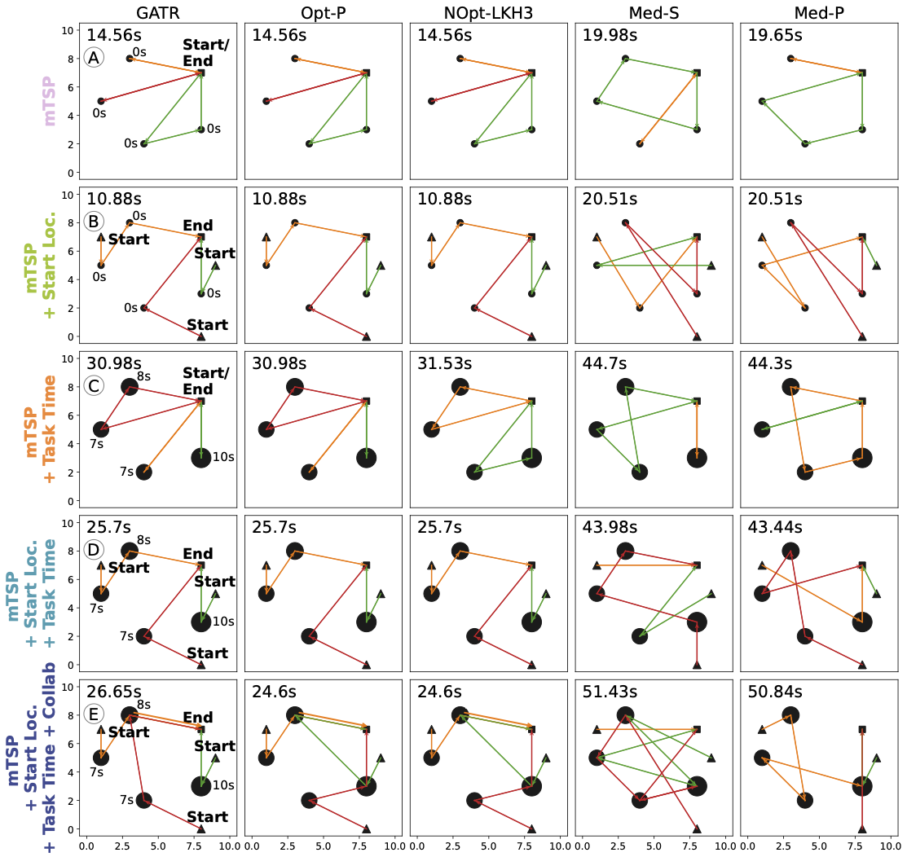

# On-board Mission Replanning for Adaptive Cooperative Multi-Robot Systems

Cooperative autonomous robotic systems have significant potential for executing complex multi-task missions across space, air, ground, and maritime domains. But they commonly operate in remote, dynamic and hazardous environments, requiring rapid in-mission adaptation without reliance on fragile or slow communication links to centralised compute. Fast, on-board replanning algorithms are therefore needed to enhance resilience. Reinforcement Learning shows strong promise for efficiently solving mission planning tasks when formulated as Travelling Salesperson Problems (TSPs), but existing methods: 1) are unsuitable for replanning, where agents do not start at a single location; 2) do not allow cooperation between agents; 3) are unable to model tasks with variable durations; or 4) lack practical considerations for on-board deployment. Here we define the Cooperative Mission Replanning Problem (CMRP) as a novel variant of multiple TSP with adaptations to overcome these issues, and develop a new encoder/decoder-based model using Graph Attention Networks and Attention Models to solve it effectively and efficiently. Using a simple example of cooperative drones, we show our replanner (GATR) consistently (90% of the time) maintains performance within 10% of the state-of-the-art LKH3 heuristic solver, whilst running 85-370 times faster on a Raspberry Pi. This work paves the way for increased resilience in autonomous multi-agent systems.


Below, we illustrate the methodology of GATR, implementations is built on top of RL4CO [1].


Here is the comparison of how GATR and other benchmarks (columns) solve
an example three-agent-four-task problem for our five progressively complex
problem types (rows). The tours of the three agents are shown in red, amber,
and green, the tasks are shown in black circles (with size corresponding to
the time cost of each task for the last three rows), and the black square
shows the home depot. In second, fourth and fifth rows, where agent start
locations differ from the depot, they are marked with a black triangle.



# Installation
The code has been tested on the following platforms and python versions:

Platform:
- macOS ✅
- Linux ✅
- Window ❌

Python version:
- Python 3.8 ❌
- Python 3.10 ✅

We recommend using either macOS or Linux and Python 3.10 for full compatibility.

1) Setup the directory where repos will be stored.
```bash
export SETUP_DIR=~
```

2) Download the repo.
```bash
git clone --recurse-submodules https://github.com/alan-turing-institute/graph-attention-replanner.git $SETUP_DIR/graph-attention-replanner
```

3) Apply our custom patch for rl4co to enable solving our mission replanning problem.
```bash
cd ${SETUP_DIR}/graph-attention-replanner/external/rl4co
git checkout v0.6.0
git apply ../../patch/rl4co.patch
```
Check if patch has been applied successfully.
```bash
cd ${SETUP_DIR}/graph-attention-replanner && ./tests/test_apply_patch.sh
```

4) Set up virtual environment via pip venv.
```bash
cd ${SETUP_DIR}/graph-attention-replanner
python3.10 -m venv .venv
source .venv/bin/activate
```

Or if you prefer conda.
<details>
<pre>
cd graph-attention-replanner
conda create -n replanner python=3.10
conda activate replanner
</pre>
</details>

5) Install dependencies.
```bash
cd ${SETUP_DIR}/graph-attention-replanner
pip install --upgrade pip
pip install -e . 
pip install -e ./external/rl4co
```

6) Install [LKH3-3.0.10](http://akira.ruc.dk/~keld/research/LKH-3/). [Optional, only if you want to test out LKH3, not required in the demo]
```bash
cd ${SETUP_DIR}/graph-attention-replanner/external
sudo apt install gcc # only for mac,linux
wget http://akira.ruc.dk/~keld/research/LKH-3/LKH-3.0.10.tgz
tar xvfz LKH-3.0.10.tgz
cd ./LKH-3.0.10
make
sudo cp LKH /usr/local/bin
```

# Short Examples
Run the [example notebooks](./graph_attention_replanner/example) to learn about:
- How to train and evaulate GATR, as well as visualize the results. [link](./graph_attention_replanner/example/getting_started.ipynb)
- How to build up the full CMRP from mTSP. [link](./graph_attention_replanner/example/building_up_problem.ipynb)
- How to benchmark GATR against other methods. [link](./graph_attention_replanner/example/benchmark.ipynb)

To reproduce the complete set of experiments, run the scripts available [here](./graph_attention_replanner/run). Start with [`run_train.py`](./graph_attention_replanner/run/run_train.py), then [`run_eval.py`](./graph_attention_replanner/run/run_train.py). After that, you can also try [`run_train_generalization.py`](./graph_attention_replanner/run/run_train_generalization.py) and [`run_eval_generalization.py`](./graph_attention_replanner/run/run_eval_generalization.py) for the generalization experiments. The corresponding results are visualized in these [notebooks](./graph_attention_replanner/plots).

# Run Demo
Set up the model at the right place.
```bash
mkdir -p ${SETUP_DIR}/graph-attention-replanner/cache/checkpoints/algo_reinforce
cd ${SETUP_DIR}/graph-attention-replanner
cp -a ./assets/checkpoints_demo/problem5_node24_task1to6_dislevel1to4_agent1to6_seed0_20241230232757 ./cache/checkpoints/algo_reinforce
```

Serve the demo website.
```bash
cd ${SETUP_DIR}/graph-attention-replanner/graph_attention_replanner/demo
python demo.py
```

# Support
Email the [author](ekwan@turing.ac.uk) for more support.

# Authors and acknowledgment
This repo is written by Elim Kwan and Rehman Qureshi. This work was supported by the Turing’s Defence and Security programme through a partnership with Dstl. This work was partially supported by an international internship on behalf of the Science, Mathematics, and Research for Transformation (SMART) Scholarship-for-Service Program within the OUSD/R&E (The Under Secretary of Defense-Research and Engineering), National Defense Education Program (NDEP) / BA-1, Basic Research. The computations described in this research were performed using the Baskerville Tier 2 HPC service (https://www.baskerville.ac.uk/). Baskerville was funded by the EPSRC and UKRI through the World Class Labs scheme (EP/T022221/1) and the Digital Research Infrastructure programme (EP/W032244/1) and is operated by Advanced Research Computing at the University of Birmingham. This work has been submitted to the IEEE for possible publication. Copyright may be transferred without notice, after which this version may no longer be accessible.

References:

[1] Federico Berto, Chuanbo Hua, Junyoung Park, Laurin Luttmann, Yining Ma, Fanchen Bu, Jiarui Wang, Haoran Ye, Minsu Kim, Sanghyeok Choi, Nayeli Gast Zepeda, André Hottung, Jianan Zhou, Jieyi Bi, Yu Hu, Fei Liu, Hyeonah Kim, Jiwoo Son, Haeyeon Kim, Davide Angioni, Wouter Kool, Zhiguang Cao, Qingfu Zhang, Joungho Kim, Jie Zhang, Kijung Shin, Cathy Wu, Sungsoo Ahn, Guojie Song, Changhyun Kwon, Kevin Tierney, Lin Xie, & Jinkyoo Park. (2024). RL4CO: an Extensive Reinforcement Learning for Combinatorial Optimization Benchmark.

# Citation
If you find our project valuable for your research:
```latex
@misc{kwan2025onboardmissionreplanningadaptive,
      title={On-board Mission Replanning for Adaptive Cooperative Multi-Robot Systems}, 
      author={Elim Kwan and Rehman Qureshi and Liam Fletcher and Colin Laganier and Victoria Nockles and Richard Walters},
      year={2025},
      eprint={2506.06094},
      archivePrefix={arXiv},
      primaryClass={cs.RO},
      url={https://arxiv.org/abs/2506.06094}, 
}
```

# License


# Project Status

